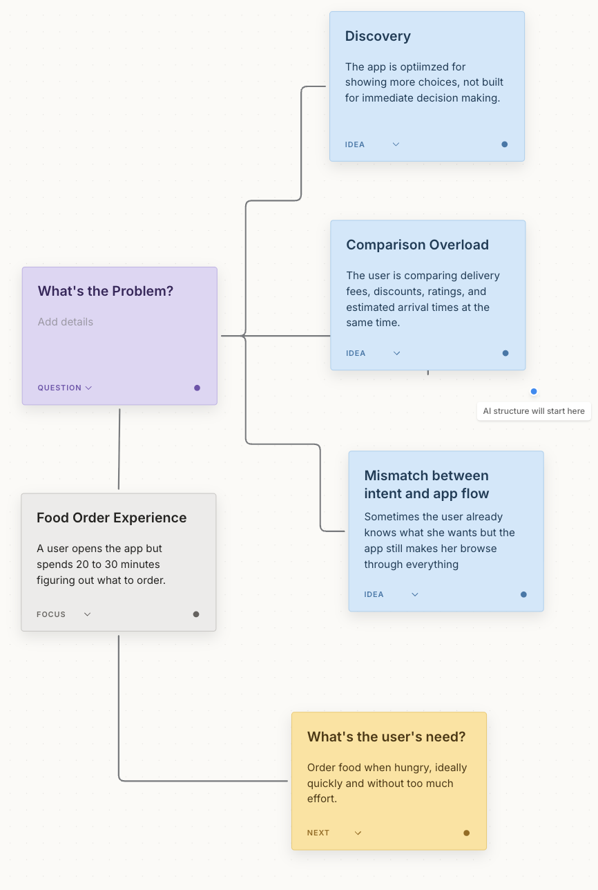

Demo

1. User Messy Voice Input
Um, I just talked to a user about how she orders food delivery, and I’m trying to figure out what the actual product problem is.
At first, I thought maybe the problem was that she couldn’t find enough good restaurants. She said she opens the app when she’s already hungry, but then she keeps scrolling for like 20 or 30 minutes.
She compares restaurants, delivery fees, discounts, ratings, estimated arrival times… and then sometimes she just gets tired before ordering. She said there are so many options that everything starts to look kind of the same.
But I’m not sure if the real problem is discovery, or price comparison, or delivery uncertainty, or just decision fatigue.
She also said sometimes she already knows what she wants, like something quick and not too expensive, but the app still makes her browse through everything. So maybe the app is optimized for showing more choices, but in that moment she just wants to make a good-enough decision quickly.
I need to prepare a product opportunity for review, but I don’t want to jump straight into a feature idea. I need to understand what the actual user need is first.

⸻

Expected Outcome
系统 提炼focus 并根据用户语义提炼并行节点 实时呈现给用户

⸻

2. AI 回复(S0->S1)
目的：配合live canvas更好地帮助用户理解现状 推进思路的梳理

I hear you. I’ve captured the main focus on the canvas:

Focus:
The user wants to order food quickly when she is already hungry, but the current app experience makes the decision feel slow and tiring.

I’m also seeing four possible problem nodes emerging from what you said:

1. Too many choices
    The user keeps scrolling for 20–30 minutes and many options start to feel the same.
2. Comparison overload
    She is comparing restaurants, delivery fees, discounts, ratings, and estimated arrival times at the same time.
3. Mismatch between intent and app flow
    She sometimes already knows she wants something quick and not too expensive, but the app still pushes her into broad browsing.
  4. Unclear root cause
    It is not yet clear whether the real problem is discovery, price comparison, delivery uncertainty, or decision fatigue.

Before jumping into a feature idea, I suggest we first understand which of these nodes is the strongest explanation for the user’s struggle.
⸻

UI 当前状态：Situation Map

画布发生转化，记录并梳理用户的输入和AI的回复：(永远都是先present一个focus然后开始发散）


  

3. AI Reasoning Panel：提出 competing hypotheses
AI Reply
Based on the current evidence, I see three competing hypotheses.

Hypothesis 1: The user needs better restaurant discovery.
This would mean the problem is that she cannot find the right restaurants.

Hypothesis 2: The user needs easier comparison.
This would mean the problem is that price, delivery time, rating, and discount information are too hard to compare.

Hypothesis 3: The user needs decision reduction.
This would mean the problem is not lack of information, but too many comparable choices when she already has a simple intent.

Right now, Hypothesis 3 seems strongest, because the user said there are too many options, not too few. She also already knows a rough intent: quick and not too expensive.

⸻

UI 当前状态：Reasoning Panel
Reasoning Panel

Competing Hypotheses:

H1: Better Discovery
Evidence strength: Low
Reason: User did not say there were too few restaurants.

H2: Easier Comparison
Evidence strength: Medium
Reason: User compares price, delivery fee, rating, discount, and ETA.

H3: Decision Reduction
Evidence strength: High
Reason:
- User scrolls for 20–30 minutes
- User says there are too many options
- User already has simple intent
- User gets tired before ordering

Current leading interpretation:
The app may be optimizing for browsing, while the user needs help making a fast good-enough decision.

⸻

Expected Outcome
这里要体现系统开始进入 S2 Analytical：
AI 不只是把问题分类，而是开始比较不同解释，并用用户说过的信息支持一个更强的判断。
PM manager 应该能看到因果链开始形成：
Too many options
→ too much comparison
→ user fatigue
→ need decision reduction

⸻

4. AI Targeted Question：推进用户判断
AI Reply
To sharpen the product opportunity, which interpretation do you think is best supported by the interview?

A. She needs to discover more restaurants.
B. She needs a faster way to make a good-enough decision.
C. She needs a more detailed comparison tool for price, ratings, and delivery time.

My current read is B, but I’d like you to confirm or correct that based on your interview memory.

⸻

UI 当前状态：Intervention Card
AI Intervention

Type:
Candidate-answer question

Purpose:
Move from problem description to product judgment.

Question:
Which need is better supported by the evidence?

A. More restaurant discovery
B. Faster good-enough decision
C. More detailed comparison

Predicted transition:
S1/S2 → S2

⸻

Expected Outcome
这个问题不是泛泛地问“你觉得呢”，而是在帮助用户做 product judgment。
它的设计目的：
* 让用户确认真正的 problem framing；
* 避免 AI 单方面下结论；
* 推动用户从“描述用户反馈”进入“判断哪个解释更成立”。

⸻

5. User Clarification：用户确认核心判断
用户原文 Script
I think B is the strongest.
She doesn’t really need more restaurants. Actually, having more restaurants might make it worse. She also doesn’t sound like she wants a spreadsheet-style comparison tool.
It’s more like, when she’s hungry, she just wants the app to help her make a decision faster. She wants something good enough, quick enough, and not too expensive. So I think the real need is reducing the decision burden.

⸻

UI 当前状态：Updated Thinking State
Updated Thinking State

Confirmed Insight:
The core need is not more discovery or more comparison.
The core need is reducing decision burden.

User’s own reasoning:
- More restaurants may make the problem worse
- Detailed comparison may increase effort
- User wants a fast, good-enough choice

State Transition:
S2 confirmed

⸻

Expected Outcome
用户应该在这个阶段完成一个清晰的认知转变：
Before:
Maybe the app needs better discovery or comparison.

After:
The app should reduce decision burden when the user already has a simple intent.
这个地方是 demo 的关键 moment。它证明 AI 的问题真的推动了用户思考，而不是只是在输出答案。

⸻

6. AI Final Artifact：Product Opportunity Brief
AI Reply
Here is the product opportunity brief based on the current reasoning.

Product Opportunity Brief

Problem Statement:
Users do not always need more food options. When they are hungry, tired, or time-constrained, they need help making a faster, good-enough food decision.

Evidence:
- The user scrolls for 20–30 minutes before ordering.
- She compares restaurants, delivery fees, discounts, ratings, and estimated arrival times.
- She says there are too many options and many start to look the same.
- She already has a simple intent, such as quick and not too expensive.
- She gets tired before completing the order.

Root Cause Hypothesis:
The current app flow is optimized for broad restaurant browsing, but this user’s real need in the moment is decision reduction.

Product Opportunity:
Create a “Quick Pick” mode that helps users make a fast, confident order decision from a small set of high-relevance options.

MVP Direction:
Quick Pick Mode

Core Experience:
1. User chooses a simple intent:
   - quick
   - cheap
   - healthy
   - comfort food
2. App shows only 3 recommended options.
3. Each option explains why it was selected:
   - fastest arrival
   - best value
   - closest match to craving
4. User can choose one or tap “show me 3 more.”
5. The flow avoids returning the user to infinite browsing.

Success Metric:
Reduce average decision time for users in quick-order mode from 20–30 minutes to under 5 minutes.

Next Validation Step:
Interview or test 5 users who often take more than 15 minutes to order food. Compare whether a 3-option recommendation flow helps them decide faster with similar or higher satisfaction.

⸻

UI 当前状态：Final Product Brief
Final Artifact

Title:
Quick Pick Mode

Core Insight:
The user does not need more options.
The user needs fewer, more confident options.

Product Judgment:
This is a decision-reduction problem, not a discovery problem.

MVP:
3-option quick ordering flow based on current intent.

Validation:
Test whether reducing options lowers decision time without reducing satisfaction.

State:
S3 Actionable

⸻

Expected Outcome
PM manager 一眼应该能看到：
这个最终结果是对的、自然的、有因果链的。
它不是随便生成一个 feature，而是从用户反馈推出来的：
User feedback:
点餐太久、选择太多、比较太累

AI reasoning:
不是缺少餐厅，而是选择过载

Product opportunity:
减少决策负担

MVP:
Quick Pick Mode

Validation:
测试 3-option flow 是否减少点餐时间

⸻

7. Evaluation Overlay：展示 S0 → S3 轨迹
UI 当前状态：Evaluation Panel
Evaluation Panel

Cluster 1: Too Many Choices
Initial State: S0
User only described scrolling and too many options.

Final State: S2
System identified choice overload as a cause of decision fatigue.

Cluster 2: Comparison Burden
Initial State: S0
User listed fees, discounts, ratings, and delivery time.

Final State: S2
System interpreted these as simultaneous comparison variables increasing cognitive load.

Cluster 3: User Intent
Initial State: S1
User said she wants something quick and not too expensive.

Final State: S3
System turned this into an MVP interaction: intent-based Quick Pick mode.

Cluster 4: Product Direction
Initial State: unclear
User was unsure whether the problem was discovery, comparison, uncertainty, or fatigue.

Final State: S3
System converged on decision reduction and proposed a testable product direction.

⸻

Expected Outcome
这个 overlay 是给 presentation 用的。它让 PM manager 不只是看到“结果不错”，而是看到：
系统如何一步步把 thinking state 往前推进。
你可以展示这个 summary：
Before AI:
The user had scattered observations and four possible problem framings.

After AI:
The user reached a clear product judgment:
This is a decision-reduction problem, not a discovery problem.

Final artifact:
A testable Quick Pick MVP with evidence, hypothesis, and validation plan.

⸻

整体 1–7 流程总览
Step	用户 / AI 发生什么	UI 显示什么	Cognitive State
1	用户 messy debrief	Live Transcript	S0
2	AI 梳理问题板块	Situation Map	S0 → S1
3	AI 提出 competing hypotheses	Reasoning Panel	S1 → S2
4	AI 问 targeted question	Intervention Card	S2 推进
5	用户确认判断	Updated Thinking State	S2
6	AI 生成 Product Brief	Final Artifact	S3
7	系统展示评估轨迹	Evaluation Panel	S0 → S3 Evidence
⸻

这个 demo 的核心价值句
你 present 的时候可以这样说：
This demo shows how the system turns a messy product discovery debrief into a decision-ready product opportunity brief.
The user starts with scattered observations from a food delivery interview: long scrolling time, too many options, comparison fatigue, and uncertainty about the real problem. Instead of immediately summarizing or generating feature ideas, the system first structures the situation into problem clusters, then compares competing hypotheses, asks one targeted question, and helps the user converge on a product judgment.
The final insight is that this is not primarily a restaurant discovery problem. It is a decision-reduction problem. That reasoning leads to a clear MVP direction: Quick Pick Mode, a flow that gives users three high-confidence options based on their current intent.
这个版本可以直接作为你后面自动化测试的 gold script。

